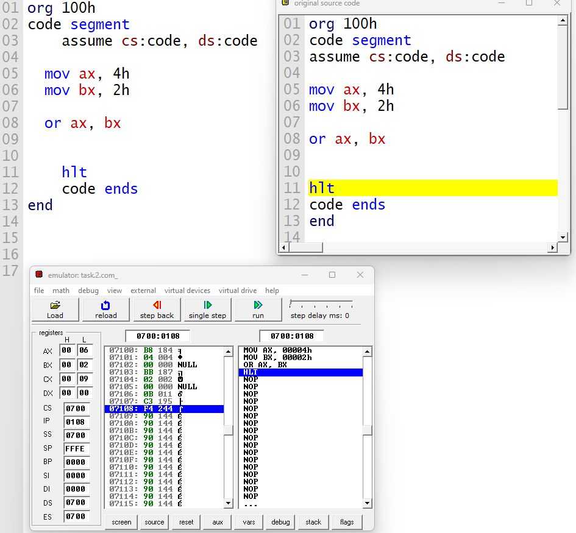

# Microprocessor Lab (CSE-364.2)

Welcome to the Microprocessor Lab repository (CSE-364.2)! 
This collection contains assembly language programs designed
 to perform basic arithmetic operations using a microprocessor.

# Programs Included 

### `add.asm`

- **Description:** Adds two numbers together.
- **Code:**
  ```assembly
  org 100h

  code segment
  assume cs:code, ds:code

  mov ax, 10h
  mov bx, 5h

  add ax, bx
  hlt

  code ends
  end

  ```
  

### `sub.asm`

- **Description:** Subtracts one number from another.
- **Code:**
  ```assembly
  org 100h

  code segment
  assume cs:code, ds:code

  mov ax, 6h
  mov bx, 4h

  sub ax, bx
  hlt

  code ends
  end
  ```
  

### `mul.asm`

- **Description:** Multiplies two numbers.
- **Code:**
  ```assembly
  org 100h

  code segment
  assume cs:code, ds:code

  mov ax, 4h
  mov bx, 2h

  mul bx
  hlt

  code ends
  end
  ```
  

### `div.asm`

- **Description:** Divides one number by another.
- **Code:**
  ```assembly
  org 100h

  code segment
  assume cs:code, ds:code

  mov ax, 8h
  mov bx, 4h

  div bx
  hlt

  code ends
  end
  ```
  

### `and.asm`

- **Description:** AND between corresponding bits of the `destination` and `source`.
- **Code:**
  ```assembly
  org 100h

  code segment
  assume cs:code, ds:code

  mov ax, 5h
  mov bx, 3h

  and ax,bx
  hlt

  code ends
  end
  ```
  

---

### `AND` Instruction in Assembly Language

The `and` instruction in assembly language is a bitwise logical operation that performs a logical AND between two operands. 
It takes the binary representation of two values and performs the AND operation bit by bit.

#### Syntax:

```assembly
and destination, source
```

- **`destination`:** Represents the register or memory location where the result will be stored.
- **`source`:** Represents the register, immediate value, or memory location used in the operation.

#### Operation:

The `and` operation performs a bitwise AND between corresponding bits of the `destination` and `source` operands:

- If both bits are 1, the resulting bit is set to 1.
- If any of the bits is 0, the resulting bit is set to 0.

#### Example:

```assembly
mov ax, 5h   ; Moves the value 5h (binary: 0101) into register AX
mov bx, 3h   ; Moves the value 3h (binary: 0011) into register BX

and ax, bx   ; Performs a bitwise AND between AX and BX

; Result:
;   AX = 0101 (5 in decimal)
;   BX = 0011 (3 in decimal)
;   Result of AND: 0101 AND 0011 = 0001 (1 in decimal)
```

In the example, the `and` operation sets each bit in the destination operand to 1 only if the corresponding bits 
in both operands are 1; otherwise, it sets the bit to 0. This operation demonstrates the logical AND behavior in assembly language.

---

### `or.asm`

- **Description:** OR between corresponding bits of the `destination` and `source`.
- **Code:**
  ```assembly
  org 100h

  code segment
  assume cs:code, ds:code

  start:
    mov ax, 4h
    mov bx, 2h

    or ax, bx

  code ends
  end start
  ```
  

---

### `OR` Instruction in Assembly Language

The `or` instruction in assembly language is a bitwise logical operation that performs a logical OR between two operands. 
It operates by comparing the binary representation of two values and performing the OR operation bit by bit.

#### Syntax:

```assembly
or destination, source
```

- **`destination`:** Represents the register or memory location where the result will be stored.
- **`source`:** Represents the register, immediate value, or memory location used in the operation.

#### Operation:

The `or` operation performs a bitwise OR between corresponding bits of the `destination` and `source` operands:

- If any of the bits are 1, the resulting bit is set to 1.
- If both bits are 0, the resulting bit is set to 0.

#### Example:

```assembly
mov ax, 4h   ; Moves the value 4h (binary: 0100) into register AX
mov bx, 2h   ; Moves the value 2h (binary: 0010) into register BX

or ax, bx   ; Performs a bitwise OR between AX and BX

; Result:
;   AX = 0100 (4 in decimal)
;   BX = 0010 (2 in decimal)
;   Result of OR: 0100 OR 0010 = 0110 (6 in decimal)
```

In the provided example, the `or` operation sets each bit in the destination operand to 1 if any of the corresponding bits 
in the source operands are 1. This demonstrates the logical OR behavior in assembly language, operating on binary values.

--- 


### `xor.asm`

- **Description:** Performs bitwise XOR operation on two numbers.
- **Code:**

  ```assembly
  org 100h

  code segment
      assume cs:code, ds:code
      
      mov ax, 6h
      mov bx, 4h 
      
      xor ax, bx
      
      hlt
  code ends
  end
  ```

  

---

### `XOR` Instruction in Assembly Language

The `xor` instruction in assembly language is a bitwise logical operation that performs an exclusive OR (XOR) between two operands. 
It operates by comparing the binary representation of two values and performing the XOR operation bit by bit.

#### Syntax:

```assembly
xor destination, source
```

- **`destination`:** Represents the register or memory location where the result will be stored.
- **`source`:** Represents the register, immediate value, or memory location used in the operation.

#### Operation:

The `xor` operation performs a bitwise XOR between corresponding bits of the `destination` and `source` operands:

- If the bits are different (one is 1 and the other is 0), the resulting bit is set to 1.
- If the bits are the same (both 1 or both 0), the resulting bit is set to 0.

#### Example:

```assembly
mov ax, 6h   ; Moves the value 6h (binary: 0110) into register AX
mov bx, 4h   ; Moves the value 4h (binary: 0100) into register BX

xor ax, bx   ; Performs a bitwise XOR between AX and BX

; Result:
;   AX = 0110 (6 in decimal)
;   BX = 0100 (4 in decimal)
;   Result of XOR: 0110 XOR 0100 = 0010 (2 in decimal)
```

In the provided example, the `xor` operation sets each bit in the destination operand based on the XOR logic applied to the source operands. This demonstrates the exclusive OR behavior in assembly language, operating on binary values.

---

## Instructions

- Each `.asm` file contains assembly code for a specific arithmetic and logical operation.
- Utilize an appropriate assembler or microprocessor simulator to assemble and execute these programs.
- Ensure a thorough understanding of the provided instructions before execution.
- Feel free to modify or expand upon these programs for experimentation or learning purposes.

**Note:** Replace `org 100h` with the appropriate origin address if required by your system.

Enjoy exploring the world of microprocessors and assembly programming!

